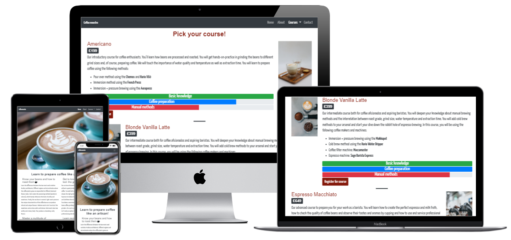

# Coffee maestro

Link to live project

User Centric Frontend Development Milestone Project for Code Institute's Diploma in Software Development

The project features a static website where barista courses are offered for purchase.

The site targets both coffee lovers who want to extend their knowledge about coffee and to learn new methods of preparation as well as aspiring baristas who want to make a career out of their passion for coffee.

Table of contents with links

## User Experience (UX)

For user personas and stories I conducted short qualitative interviews with colleagues, friends and family. I used the results to generate five user personas. Two of them are different kind of online shoppers and the remaining three personas are coffee drinkers with varying goals for visiting the site.

### User personas

- Persona1: casual coffee drinker
- Persona2: coffee enthusiast
- Persona3: aspiring barista
- Persona4: frequent online shopper
- Persona5: sporadic online shopper

For these personas I created the following user stories:

#### As a frequent online shopper I want

- to quickly find out how I can contact customer support so that I don’t have to look for long if I have to contact them
- easy return options for the product so that  I don’t have to spend too much time if I want to return the product
- several payment options so that I can choose the option that best fits my requirements

#### As a sporadic online shopper I want

- to be able to place orders on account so that I can be sure that I’m not being scammed
- to quickly find my way around the page so that I don’t get lost
- to buy directly from the manufacturer so that I support small vendors/suppliers
- to see product ratings/evaluations from other customers so that I can be sure that the product meets my requirements

#### As a casual coffee drinker I want

- to gift a course to a friend so that I can make him/her happy

#### As a coffee enthusiast I want

- to learn how to make specialty coffees so that I can prepare a greater variety of coffees and also impress my friends

#### An an aspiring barista I want

- to find an affordable, certified barista course so that I improve my chances of getting a job a a barista

### Site owners Goals

- to attract different kind of buyers to the site
- to generate sales
- to generate returning visitors and sales
- to generate a network of potential partners for future collaborations

- User Requirements and Expectations (already included in the above section?)

- Requirements
- Expectations

## Design

### Colour Scheme

I used variations of black, white and grey as main colours for a modern and professional look. To add warmth and a nice contrast I used warm colours like shades of orange for some backgrounds and headings. I used [Coolors](https://coolors.co) to generate my colour palette.

### Typography

For fonts, I used [Google Fonts](https://fonts.google.com) to compare various designs. I chose Yanone Kaffeesatz as my primary display typeface. I wanted to recreate the style and allure of coffee houses from the 1920s. Additionally, being used on coffee and food-related packaging worldwide adds a subliminal familiarity. As secondary font I chose Roboto to add both a strong, but nice contrast and a modern touch.

### Icons

I implemented icons from [Font Awesome](https://fontawesome.com) on the landing page to catch the user's eye without distracting from the content.

### Imagery

All images were taken from [Unsplash](https://unsplash.com). Credit for the individual pictures is given below.

#### index.html

Heropic: Photo by [Ben Garratt](https://unsplash.com/@wstn?utm_source=unsplash&utm_medium=referral&utm_content=creditCopyText) on [Unsplash](https://unsplash.com/s/photos/latte-art?utm_source=unsplash&utm_medium=referral&utm_content=creditCopyText)

Male customer on the left: Photo by [Nicolas Horn](https://unsplash.com/@chiefexof?utm_source=unsplash&utm_medium=referral&utm_content=creditCopyText) on [Unsplash](https://unsplash.com/s/photos/human-face?utm_source=unsplash&utm_medium=referral&utm_content=creditCopyText)

Female customer in the middle: Photo by [Cuong Doan](https://unsplash.com/@huyencuong?utm_source=unsplash&utm_medium=referral&utm_content=creditCopyText) on [Unsplash](https://unsplash.com/s/photos/human-face?utm_source=unsplash&utm_medium=referral&utm_content=creditCopyText)

Male customer to the right: Photo by [Sigmund](https://unsplash.com/@sigmund?utm_source=unsplash&utm_medium=referral&utm_content=creditCopyText) on [Unsplash](https://unsplash.com/s/photos/human-face?utm_source=unsplash&utm_medium=referral&utm_content=creditCopyText)

#### courses.html

Tablet with latte macchiato and glass of water: Photo by [An Nguyen](https://unsplash.com/@ngocan_19?utm_source=unsplash&utm_medium=referral&utm_content=creditCopyText) on [Unsplash](https://unsplash.com/s/photos/latte-macchiato?utm_source=unsplash&utm_medium=referral&utm_content=creditCopyText)

Coffee beans, ground coffee and latte art: Photo by [Nathan Dumlao](https://unsplash.com/@nate_dumlao?utm_source=unsplash&utm_medium=referral&utm_content=creditCopyText) on [Unsplash](https://unsplash.com/s/photos/latte-macchiato?utm_source=unsplash&utm_medium=referral&utm_content=creditCopyText)

Counter with 2 professional espresso machines: Photo by [Nathan Dumlao](https://unsplash.com/@nate_dumlao?utm_source=unsplash&utm_medium=referral&utm_content=creditCopyText) on [Unsplash](https://unsplash.com/s/photos/latte-macchiato?utm_source=unsplash&utm_medium=referral&utm_content=creditCopyText)

### Structure

### Wireframes

I used Balsamiq to create my wireframes. It is beginner-friendly and very intuitive to use. To better demonstrate the differences, I sort my wireframes by page and show the versions for mobile, tablet and desktop next to each other.

[wireframes for index.html](assets/images/wireframes/index.png)  
Differences in the deployed version:

- All navbar links have been moved to the right side due to a markup validator error message.
- Also due to a validator error message, a heading has been added to the jumbotron with the hero image.
- The small hero image 2 hasn't been implemented. In my opinion it wouldn't have improved the site.

[wireframes for about.html](assets/images/wireframes/about.png)

[wireframes for courses.html](assets/images/wireframes.courses.png)  
Differences in the deployed version:

- For mobile devices, the images have been removed to improve loading times
- And additional heading and badges have been added for each course

[wireframes for contact.html](assets/images/wireframes/contact.png)  
Differences in the deployed version:

- To better space the elements, the email address has been put in it's own column on all devices except mobiles
- A second button has been added to give the user the possibility to clear the form
- Icons have been added to the buttons
- The embedded Google Map has been placed below the contact form on all devices

## Features

### Existing Features

- The site is responsive
- The navbar allows quick navigation throughout the site
- Colours and icons are used to mix things up without distracting from the content
- Progress bars give a quick overview of the courses' main features
- Radio buttons make sure that only one payment option is chosen
- Cancel/Clear form buttons allow the user to control his input
- The embedded Google Map allows the user a quick overview with additional links for directions and a larger map, which open in a new tab
- Links to the company's social media are provided and open in new tabs

Features to be implemented

- Option for the user to choose date and place for the course
- Option to buy course vouchers as a gift
- Payment processing

## Technologies Used

### Languages

- HTML5
- CSS3

### Libraries & Frameworks

- Bootstrap 4.5.3
- Google Fonts
- Font Awesome

### Tools

- VSCode
- Git
- GitHub
- Google Chrome Developer Tools
- Sizzy
- Balsamiq
- Coolors colour palette generator
- Techsini
- Google Cloud Platform
- W3C HTML Validation Service
- W3C CSS Validation Service

## Testing

Element name

- Plan
- Implementation
- Test
- Result
- Verdict

Final testing

- W3C Markup Validator Results
- W3C CSS Validator Results
- Lighthouse Results
- WAVE Evaluation Tool Results

Testing User Stories from User Experience Section (???)

## Bugs

Element

- Bug
- Fix

## Deployment

- Git Hub Pages
- Forking
- Cloning

## Credits

- Content
- Media
- Inspiration

## Acknowledgements
