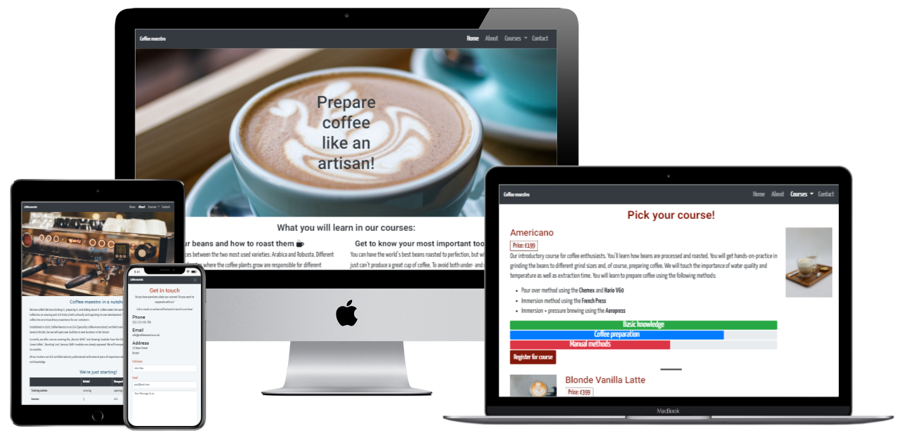

# **Coffee maestro**

Link to live project: [Coffee maestro](https://ryagg.github.io/ms1-coffee-maestro)

User Centric Frontend Development Milestone Project for Code Institute's Diploma in Software Development

The project features a static website where barista courses are offered for purchase.

The site targets both coffee lovers who want to extend their knowledge about coffee and to learn new methods of preparation as well as aspiring baristas who want to make a career out of their passion for coffee.

## **Table of contents**

- [**Coffee maestro**](#--coffee-maestro--)
  - [**Table of contents**](#--table-of-contents--)
  - [**User Experience (UX)**](#--user-experience--ux---)
    - [**User personas**](#--user-personas--)
      - [As a frequent online shopper I want](#as-a-frequent-online-shopper-i-want)
      - [As a sporadic online shopper I want](#as-a-sporadic-online-shopper-i-want)
      - [As a casual coffee drinker I want](#as-a-casual-coffee-drinker-i-want)
      - [As a coffee enthusiast I want](#as-a-coffee-enthusiast-i-want)
      - [An an aspiring barista I want](#an-an-aspiring-barista-i-want)
    - [**Site owners Goals**](#--site-owners-goals--)
    - [**User Requirements and Expectations**](#--user-requirements-and-expectations--)
      - [Expectation: being able to easily contact support](#expectation--being-able-to-easily-contact-support)
      - [Expectation: being able to quickly navigate the page](#expectation--being-able-to-quickly-navigate-the-page)
      - [Expectation: being able to view evaluations from other customers](#expectation--being-able-to-view-evaluations-from-other-customers)
      - [Expectation: being able to gift courses](#expectation--being-able-to-gift-courses)
      - [Expectation: learning how make speciality coffees](#expectation--learning-how-make-speciality-coffees)
      - [Expectation: finding an affordable, certified barista course](#expectation--finding-an-affordable--certified-barista-course)
  - [**Design**](#--design--)
    - [**Colour Scheme**](#--colour-scheme--)
    - [**Typography**](#--typography--)
    - [**Icons**](#--icons--)
    - [**Imagery**](#--imagery--)
      - [index.html](#indexhtml)
      - [about.html](#abouthtml)
      - [courses.html](#courseshtml)
    - [**Wireframes**](#--wireframes--)
  - [**Features**](#--features--)
    - [**Existing Features**](#--existing-features--)
    - [**Features to be implemented**](#--features-to-be-implemented--)
  - [**Technologies Used**](#--technologies-used--)
    - [**Languages**](#--languages--)
    - [**Libraries & Frameworks**](#--libraries---frameworks--)
    - [**Tools**](#--tools--)
  - [**Testing**](#--testing--)
    - [**Navigation bar**](#--navigation-bar--)
    - [**Mailing list**](#--mailing-list--)
    - [**Modal**](#--modal--)
    - [**Contact**](#--contact--)
    - [**Map**](#--map--)
    - [**Final testing**](#--final-testing--)
  - [**Bugs**](#--bugs--)
  - [**Deployment**](#--deployment--)
  - [**Credits**](#--credits--)
    - [**Content**](#--content--)
    - [**Media**](#--media--)
  - [**Inspiration**](#--inspiration--)
    - [**Acknowledgements**](#--acknowledgements--)

<small><i><a href='http://ecotrust-canada.github.io/markdown-toc/'>Table of contents generated with markdown-toc</a></i></small>

## **User Experience (UX)**

***

For user personas and stories I conducted short qualitative interviews with colleagues, friends and family. I used the results to generate five user personas. Two of them are different kind of online shoppers and the remaining three personas are coffee drinkers with varying goals for visiting the site.

### **User personas**

- Persona1: casual coffee drinker
- Persona2: coffee enthusiast
- Persona3: aspiring barista
- Persona4: frequent online shopper
- Persona5: sporadic online shopper

For these personas I created the following user stories:

#### As a frequent online shopper I want

- to quickly find out how I can contact customer support so that I don’t have to look for long if I have to contact them
- easy return options for the product so that  I don’t have to spend too much time if I want to return the product
- several payment options so that I can choose the option that best fits my requirements

#### As a sporadic online shopper I want

- to be able to place orders on account so that I can be sure that I’m not being scammed
- to quickly find my way around the page so that I don’t get lost
- to buy directly from the manufacturer so that I support small vendors/suppliers
- to see product ratings/evaluations from other customers so that I can be sure that the product meets my requirements

#### As a casual coffee drinker I want

- to gift a course to a friend so that I can make him/her happy

#### As a coffee enthusiast I want

- to learn how to make specialty coffees so that I can prepare a greater variety of coffees and also impress my friends

#### An an aspiring barista I want

- to find an affordable, certified barista course so that I improve my chances of getting a job a a barista

### **Site owners Goals**

- to attract different kind of buyers to the site
- to generate sales
- to generate returning visitors and sales
- to generate a network of potential partners for future collaborations

### **User Requirements and Expectations**

Based on the above user stories, I developed the following user requirements and expectations. Due to the limitations (Frontend only)of this project, not all user stories could be taken into consideration or be fully tested, e.g. different payment options. Furthermore, due to nature of the product being offered not all expectations are applicable, e.g. easy return options. These were also not taken into consideration.

#### Expectation: being able to easily contact support

- Requirement: provide user with several options to contact support and make them easy to find
- Implementation: the contact page provides the user both with the necessary data to contact support per phone, mail or letter and a form he/she can fill out and submit.

#### Expectation: being able to quickly navigate the page

- Requirement: offer a navbar like users have learned to expect from websites
- Implementation: The navbar is positioned at the top of the site and is clearly labelled.

#### Expectation: being able to view evaluations from other customers

- Requirement: Collect feedback from customers. Place it on the site where it can be easily spotted.
- Implementation: the bottom of the landing page features quotes from the (fictive) customers.

#### Expectation: being able to gift courses

- Requirement: Create vouchers and make them work within payment processing
- Implementation: not yet implemented.

#### Expectation: learning how make speciality coffees

- Requirement: include appropriate content about coffee preparation in all courses
-Implementation: each course features the preparation of speciality coffees which grow more complex with each course.

#### Expectation: finding an affordable, certified barista course

- Requirement: become SCA certified. Use SEO so that potential customers can find out about the course.
- Implementation: the most advanced course is SCA-certified, new courses with certification will be offered and - rudimentary - SEO is used.

## **Design**

***

### **Colour Scheme**

I used variations of black, white and grey as main colours for a modern and professional look. To add warmth and a nice contrast I used warm colours like shades of orange for some backgrounds and headings. I used [Coolors](https://coolors.co) to generate my colour palette.

### **Typography**

For fonts, I used [Google Fonts](https://fonts.google.com) to compare various designs. I chose Yanone Kaffeesatz as my primary display typeface. I wanted to recreate the style and allure of coffee houses from the 1920s. Additionally, being used on coffee and food-related packaging worldwide adds a subliminal familiarity. As secondary font I chose Roboto to add both a strong, but nice contrast and a modern touch.

### **Icons**

I implemented icons from [Font Awesome](https://fontawesome.com) on the landing page to catch the user's eye without distracting from the content.

### **Imagery**

All images were taken from [Unsplash](https://unsplash.com). Credit for the individual pictures is given below.

#### index.html

Heropic: Photo by [Ben Garratt](https://unsplash.com/@wstn?utm_source=unsplash&utm_medium=referral&utm_content=creditCopyText) on [Unsplash](https://unsplash.com/s/photos/latte-art?utm_source=unsplash&utm_medium=referral&utm_content=creditCopyText)

Male customer on the left: Photo by [Nicolas Horn](https://unsplash.com/@chiefexof?utm_source=unsplash&utm_medium=referral&utm_content=creditCopyText) on [Unsplash](https://unsplash.com/s/photos/human-face?utm_source=unsplash&utm_medium=referral&utm_content=creditCopyText)

Female customer in the middle: Photo by [Cuong Doan](https://unsplash.com/@huyencuong?utm_source=unsplash&utm_medium=referral&utm_content=creditCopyText) on [Unsplash](https://unsplash.com/s/photos/human-face?utm_source=unsplash&utm_medium=referral&utm_content=creditCopyText)

Male customer to the right: Photo by [Sigmund](https://unsplash.com/@sigmund?utm_source=unsplash&utm_medium=referral&utm_content=creditCopyText) on [Unsplash](https://unsplash.com/s/photos/human-face?utm_source=unsplash&utm_medium=referral&utm_content=creditCopyText)

#### about.html

Background image: Photo by [Crew](https://unsplash.com/@crew?utm_source=unsplash&utm_medium=referral&utm_content=creditCopyText) on [Unsplash](https://unsplash.com/?utm_source=unsplash&utm_medium=referral&utm_content=creditCopyText)

#### courses.html

Tablet with latte macchiato and glass of water: Photo by [An Nguyen](https://unsplash.com/@ngocan_19?utm_source=unsplash&utm_medium=referral&utm_content=creditCopyText) on [Unsplash](https://unsplash.com/s/photos/latte-macchiato?utm_source=unsplash&utm_medium=referral&utm_content=creditCopyText)

Coffee beans, ground coffee and latte art: Photo by [Nathan Dumlao](https://unsplash.com/@nate_dumlao?utm_source=unsplash&utm_medium=referral&utm_content=creditCopyText) on [Unsplash](https://unsplash.com/s/photos/latte-macchiato?utm_source=unsplash&utm_medium=referral&utm_content=creditCopyText)

Counter with 2 professional espresso machines: Photo by [Nathan Dumlao](https://unsplash.com/@nate_dumlao?utm_source=unsplash&utm_medium=referral&utm_content=creditCopyText) on [Unsplash](https://unsplash.com/s/photos/latte-macchiato?utm_source=unsplash&utm_medium=referral&utm_content=creditCopyText)

### **Wireframes**

I used Balsamiq to create my wireframes. It is beginner-friendly and very intuitive to use. To better demonstrate the differences, I sort my wireframes by page and show the versions for mobile, tablet and desktop next to each other.

[wireframes for index.html](assets/images/wireframes/index.png)  
Differences in the deployed version:

- All navbar links have been moved to the right side due to a markup validator error message.
- Also due to a validator error message, a heading has been added to the jumbotron with the hero image.
- The small hero image 2 hasn't been implemented. In my opinion it wouldn't have improved the site.

[wireframes for about.html](assets/images/wireframes/about.png)  
Differences in the deployed version:

- I chose to use a background image, which is displayed above the text for all resolutions instead of an image, which is displayed to the left or right side of the text for larger resolutions.
- Instead of a second list I added the option to subscribe to a mailing list. The mailing list is placed beneath the table for all resolutions.

[wireframes for courses.html](assets/images/wireframes.courses.png)  
Differences in the deployed version:

- For mobile devices, the images have been removed to improve loading times
- And additional heading and badges have been added for each course

[wireframes for contact.html](assets/images/wireframes/contact.png)  
Differences in the deployed version:

- To better space the elements, the email address has been put in it's own column on all devices except mobiles
- A second button has been added to give the user the possibility to clear the form
- Icons have been added to the buttons
- The embedded Google Map has been placed below the contact form on all devices

## **Features**

***

### **Existing Features**

- The site is responsive
- The navbar allows quick navigation throughout the site
- Colours and icons are used to mix things up without distracting from the content
- Progress bars give a quick overview of the courses' main features
- Radio buttons make sure that only one payment option is chosen
- Cancel/Clear form buttons allow the user to control his input
- The embedded Google Map allows the user a quick overview with additional links for directions and a larger map, which open in a new tab
- Links to the company's social media are provided and open in new tabs

### **Features to be implemented**

- Option for the user to choose date and place for the course
- Option to buy course vouchers as a gift
- Payment processing

## **Technologies Used**

### **Languages**

- [HTML5](https://developer.mozilla.org/en-US/docs/Web/Guide/HTML/HTML5)
- [CSS3](https://developer.mozilla.org/en-US/docs/Web/CSS)

### **Libraries & Frameworks**

- [Bootstrap 4.5.3](https://getbootstrap.com/docs/4.5/getting-started/introduction/)
- [Google Fonts](https://fonts.google.com/)
- [Font Awesome](https://fontawesome.com/)

### **Tools**

- [VSCode](https://code.visualstudio.com/)
- [Git BASH](https://gitforwindows.org/)
- [GitHub](https://github.com/)
- [Google Chrome Developer Tools](https://developer.chrome.com/docs/devtools/)
- [Sizzy](https://sizzy.co/)
- [Balsamiq](https://balsamiq.com/)
- [Coolors colour palette generator](https://coolors.co/)
- [Techsini](http://techsini.com/multi-mockup/)
- [IrfanView](https://www.irfanview.com/)
- [Google Cloud Platform](https://cloud.google.com/)
- [W3C HTML Validation Service](https://validator.w3.org/)
- [W3C CSS Validation Service](https://jigsaw.w3.org/css-validator/)
- [GitHub Wiki TOC generator](https://ecotrust-canada.github.io/markdown-toc/)

## **Testing**

***

### **Navigation bar**

- Plan  
Make the site easy to navigate by providing a navbar and using easily understandable names for the pages.
- Implementation  
I used the Bootstrap navbar and added several Bootstrap classes to position it on the right side for all devices, except mobiles. On mobile devices I also used Bootstrap to make the navbar collapse and be displayed within the hamburger sign.
- Test  
I tested all links on all pages and with different browsers to make sure that the correct site is displayed.
- Result  
Each site is reachable from every page and on every browser.
- Verdict  
Working as intended.

### **Mailing list**

- Plan  
Give the user the opportunity to be updated with news about the courses and training centres.
- Implementation  
I used the Bootstrap form-row with client-side validation and the required attribute so that the user can subscribe to the site's mailing list.
- Test  
I tried to subscribe without entering any data and without a complete email address.
- Result  
When clicking 'Subscribe' without entering any data, the user is asked to fill out the field. When entering a non-valid email address, the user is asked to add the missing part.
- Verdict  
Working as intended.

### **Modal**

- Plan  
Give the user the opportunity to book a place in a course and choose his/her preferred payment option. The user should receive feedback after a successful booking. The user should also be able to cancel the process.
- Implementation  
I used Bootstrap for the modal and made it scrollable and centred with Bootstrap classes. I also used client-side validation. For the payment options I used radio buttons. In addition to a 'Submit' button I also implemented a 'Cancel' button.
- Test  
I tried to submit without filling out all fields, without choosing a preferred payment option and I tried to cancel the process.
- Result  
When clicking 'Submit' without filling out all fields or without choosing a preferred payment option or when entering invalid data the user is asked to enter the missing data or to correct his/her input. After the data has been submitted the user is shown a confirmation. The process can be cancelled at all times.
- Verdict  
Working as intended.

### **Contact**

- Plan  
Give the user the opportunity to easily contact support or a representative of the company and receive feedback about a successful submission. The user should be able to cancel the process.
- Implementation  
I used Bootstrap form groups and textarea with client-side validation. The user can either submit his/her data or clear the form.
- Test  
I tried to submit without entering any data, without filling out all forms and to clear the form.
- Result  
When clicking 'Submit' without filling out any or all fields or when entering invalid data the user is asked to enter the missing data or to correct his/her input. After the data has been submitted the user is shown a confirmation. The process can be cancelled at all times.
- Verdict  
Working as intended.

### **Map**

- Plan  
Give the user the opportunity to see at a glance where the courses will take place, to view a larger map and to get directions.
- Implementation  
I used an iFrame with an embedded responsive Google Map. I registered an API key at [Google Cloud Platform](https://cloud.google.com/) and restricted both the URLs that can use the key and the APIs that can be accessed with it. I used the instructions at [developers.google.com](https://developers.google.com/maps/documentation/embed/get-api-key) to create and restrict the API key.
- Test  
Check whether the map is displayed. Click on links for larger maps and directions.
- Result  
The map is displayed and the larger map and the directions link open in new tabs.
- Verdict
Working as intended.

### **Final testing**

- [W3C Markup Validator](https://validator.w3.org/) Results  
No errors are reported.
- [W3C CSS Validator](https://jigsaw.w3.org/css-validator/) Results  
When using 'validate by direct input' no errors are found. Several warnings are displayed due to the usage of vendor prefixes.  
 When using 'validate by URI' two errors and several hundred warnings are found, which are caused by the bootstrap CSS-file.
- Lighthouse Results  
Lighthouse was used for each page in mobile and desktop view. The results are linked below.  
  - [index-mobile](assets/lighthouse-reports/index-mobile.png)  
  - [index-desktop](assets/lighthouse-reports/index-desktop.png)  
  - [about-mobile](assets/lighthouse-reports/about-mobile.png)  
  - [about-desktop](assets/lighthouse-reports/about-desktop.png)  
  - [courses-mobile](assets/lighthouse-reports/courses-mobile.png)  
  - [courses-desktop](assets/lighthouse-reports/courses-desktop.png)  
  - [contact-mobile](assets/lighthouse-reports/contact-mobile.png)  
  - [contact-desktop](assets/lighthouse-reports/contact-desktop.png)

- WAVE Evaluation Tool Results  
While I think that the web accessibility evaluation tool (WAVE) is quite useful, it does have some irritating features. Firstly, it doesn't allow for any kind of report to be exported. Secondly, it keeps on showing 4 contrast errors. When viewed in detail, the contrast is shown for my background colour #343A40 and a foreground colour #007BFF. This colour isn't used by any elements on my pages, but it is included in the imported bootstrap CSS-file. Therefore, I decided against using the WAVE tool.

## **Bugs**

***

Throughout the development process several tools (Chrome Developer Tools including Lighthouse, Sizzy, W3C Markup and CSS Validators) have been used to find bugs. Please refer to commit messages with the 'fix' prefix. At the time of submission I'm not aware of further bugs.

## **Deployment**

***

- GitHub Pages  

  1. The project was deployed on GitHub Pages. The following steps were taken.
  2. In the repository, go the the project main page.
  3. Click on 'Settings' and then scroll down to the section 'GitHub Pages'.
  4. Click on the link for the new dedicated Page settings tab.
  5. In the new window using the drop-down menu select the main branch and then click on 'Save'.
  6. The site is now published and a link is provided.

- Forking  
If you wish to use this repository as a starting point or to propose changes to this project, you can fork it. Follow the steps below.
  1. Navigate to the repository, e.g. [Ryagg/ms1-coffee-maestro](https://github.com/Ryagg/ms1-coffee-maestro)
  2. Click 'Fork' in the top-right corner.

- Cloning  
  Cloning a repository creates a local copy on your computer. Follow the steps below.
    1. Navigate to the repository, e.g. [Ryagg/ms1-coffee-maestro](https://github.com/Ryagg/ms1-coffee-maestro)
    2. Click 'Code' above the list of files.
    3. In the new window, cloning using HTTPS is the default option. Copy the provided link manually or by clicking on the clipboard symbol.
    4. Open Git Bash.
    5. Navigate to your desired directory for the cloned project.
    6. Type 'git clone' followed by the URL copied in step 3.
    7. Press **Enter** to create your local clone.

## **Credits**

***

### **Content**

All content for this project was written by myself.

### **Media**

All photos used for this project were obtained from [Unsplash](https://unsplash.com). Please refer to the [**Imagery**](#--imagery--) section for credits for the individual photos.

## **Inspiration**

I used [hejcoffee](https://www.hejcoffee.co.uk/barista-courses/) and [artisancoffeeschool](https://www.artisancoffeeschool.co.uk/our-courses/) as templates for the courses on my site.

### **Acknowledgements**

Many thanks to the following persons:  

- My mentor Maranatha Ilesanmi for his helpful insights and feedback.
- My brother Thomas Lange and my colleagues Matthias Rieger, Cordula Mzyk-Zourelidis, Ekaterina Vakhonina and Alla Krause for their willingness to test the site and their feedback.
